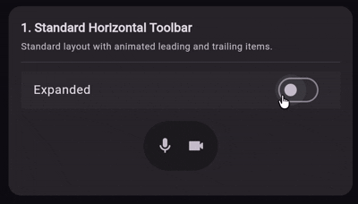
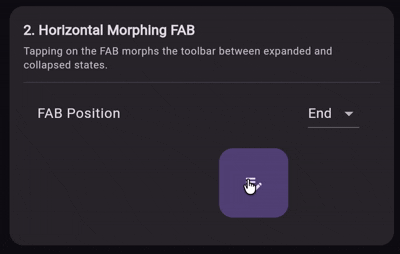

# M3E Floating Toolbar


A Flutter package providing expressive, Material 3 floating toolbar components. Features smooth spring-driven expand/collapse animations with FAB-morphing variants, scroll-to-exit behavior, and rich customization via `M3EFloatingToolbarDecoration`.

It provides four toolbar variants (horizontal/vertical, standard/FAB-morphing) that can be placed inside normal `Stack` layouts or combined with scroll behaviors for auto-hide on scroll. It gives extensive customization options including custom colors, custom border shapes, custom motion physics, and accessibility custom semantics actions.

---

## 🎮 Interactive Demo

You can try out the package demo here: [m3e_core demo](https://mudit200408.github.io/m3e_core/)

---

## 🚀 Features

- **Horizontal & Vertical layouts** — standard or FAB-anchored morphing toolbars
- **Spring-driven motion** — expressive motion presets via `M3EMotion` or fully custom spring physics
- **Scroll-to-exit** — toolbars auto-hide on scroll with configurable direction, threshold, and settle animation
- **Nested scroll expand/collapse** — scroll up/down to toggle toolbar visibility via `M3EFloatingToolbarVerticalNestedScroll`
- **FAB morphing** — toolbars that expand/collapse from a Floating Action Button with spring animation
- **Color theming** — standard and vibrant color palettes, fully customizable via `M3EFloatingToolbarColors`
- **Accessibility** — custom semantics actions for TalkBack / VoiceOver
- **Tooltip support** — long-press tooltip for all toolbar variants

---

## 📦 Installation

```yaml
dependencies:
  m3e_floating_toolbar: ^0.0.1
```

```dart
import 'package:m3e_floating_toolbar/m3e_floating_toolbar.dart';
```

---

## 🧩 Quick Start

### Standard Horizontal Toolbar



```dart
M3EHorizontalFloatingToolbar(
  expanded: true,
  decoration: M3EFloatingToolbarDecoration(
    colors: M3EFloatingToolbarDefaults.standardColors(context),
  ),
  leadingContent: IconButton(
    icon: const Icon(Icons.attachment_rounded),
    onPressed: () {},
  ),
  content: Row(
    mainAxisSize: MainAxisSize.min,
    children: [
      IconButton(icon: const Icon(Icons.mic_rounded), onPressed: () {}),
      IconButton(icon: const Icon(Icons.videocam_rounded), onPressed: () {}),
    ],
  ),
  trailingContent: IconButton(
    icon: const Icon(Icons.send_rounded),
    onPressed: () {},
  ),
)
```

### Horizontal FAB Morphing Toolbar



```dart
M3EFabHorizontalFloatingToolbar(
  expanded: _expanded,
  decoration: M3EFloatingToolbarDecoration(
    colors: M3EFloatingToolbarDefaults.standardColors(context),
  ),
  fabPosition: M3EFloatingToolbarHorizontalFabPosition.end,
  floatingActionButton: M3EFloatingToolbarDefaults.standardFab(
    onPressed: () => setState(() => _expanded = !_expanded),
    context: context,
    child: Icon(_expanded ? Icons.close_rounded : Icons.edit_note_rounded),
  ),
  content: Row(
    mainAxisSize: MainAxisSize.min,
    children: [
      IconButton(icon: const Icon(Icons.image_outlined), onPressed: () {}),
      IconButton(icon: const Icon(Icons.palette_outlined), onPressed: () {}),
    ],
  ),
)
```

---

## 📖 Detailed API Guide

### 1. `M3EMotion`

Spring physics configuration with 12 built-in presets and custom spring support.

#### 🏗️ Spatial Presets (Shape Morphing)
Used for animating container shape and layout transitions.

| Preset | Stiffness | Damping | Description |
|--------|-----------|---------|-------------|
| `standardSpatialFast` | `1400` | `0.9` | Snappy spring for responsive feel |
| `standardSpatialDefault` | `700` | `0.9` | Balanced spring for general use |
| `standardSpatialSlow` | `300` | `0.9` | Relaxed spring for dramatic feel |
| `expressiveSpatialFast` | `800` | `0.6` | Bouncier spring for expressive feel |
| `expressiveSpatialDefault` | `380` | `0.8` | Bouncy, balanced spring |
| `expressiveSpatialSlow` | `200` | `0.8` | Very bouncy for dramatic feel |

#### ✨ Effects Presets (Opacity/Scale)
Used for content animations like cross-fades.

| Preset | Stiffness | Damping | Description |
|--------|-----------|---------|-------------|
| `standardEffectsFast` | `3800` | `1.0` | Snappy effect animation |
| `standardEffectsDefault` | `1600` | `1.0` | Balanced effect animation |
| `standardEffectsSlow` | `800` | `1.0` | Relaxed effect animation |
| `expressiveEffectsFast` | `3800` | `1.0` | Snappy expressive effect |
| `expressiveEffectsDefault` | `1600` | `1.0` | Balanced expressive effect |
| `expressiveEffectsSlow` | `800` | `1.0` | Relaxed expressive effect |

#### 🛠️ Custom Motion

```dart
M3EMotion.custom(stiffness: 1200, damping: 0.75)
```

---

### 2. `M3EFloatingToolbarColors`

Container and FAB color configuration.

| Field | Type | Description |
|-------|------|-------------|
| `toolbarContainerColor` | `Color` | Toolbar background color |
| `toolbarContentColor` | `Color` | Toolbar icon/text color |
| `fabContainerColor` | `Color` | FAB background color |
| `fabContentColor` | `Color` | FAB icon/text color |

Use `M3EFloatingToolbarDefaults.standardColors(context)` for surface-based scheme or `.vibrantColors(context)` for primary-container-based scheme.

---

### 3. `M3EFloatingToolbarDecoration`

Styling and animation overrides for all toolbar variants.

| Parameter | Type | Default | Description |
|-----------|------|---------|-------------|
| `colors` | `M3EFloatingToolbarColors?` | Theme-derived | Custom colors for toolbar and FAB |
| `contentPadding` | `EdgeInsetsGeometry?` | `EdgeInsets.all(8)` | Padding inside toolbar container |
| `shape` | `ShapeBorder?` | `StadiumBorder()` | Border shape of the toolbar |
| `motion` | `M3EMotion?` | `expressiveSpatialFast` / `standardEffectsFast` | Spring physics configuration |
| `expandedShadowElevation` | `double?` | `0` (plain) / `1` (FAB) | Elevation when expanded |
| `collapsedShadowElevation` | `double?` | `0` | Elevation when collapsed |

```dart
M3EFloatingToolbarDecoration(
  colors: M3EFloatingToolbarDefaults.vibrantColors(context),
  shape: RoundedRectangleBorder(borderRadius: BorderRadius.circular(20)),
  motion: M3EMotion.custom(stiffness: 600, damping: 0.8),
)
```

---

### 4. Toolbar Widgets

#### `M3EHorizontalFloatingToolbar`

Standard horizontal toolbar with animated leading and trailing content.

| Parameter | Type | Description |
|-----------|------|-------------|
| `expanded` | `bool` | Whether the toolbar is expanded |
| `content` | `Widget` | Main toolbar content |
| `leadingContent` | `Widget?` | Animated leading side widget |
| `trailingContent` | `Widget?` | Animated trailing side widget |
| `scrollBehavior` | `M3EFloatingToolbarScrollBehavior?` | Scroll exit configuration |
| `decoration` | `M3EFloatingToolbarDecoration?` | Styling overrides |
| `onExpandA11y` | `VoidCallback?` | A11y expand action |
| `onCollapseA11y` | `VoidCallback?` | A11y collapse action |
| `tooltip` | `String?` | Long-press tooltip |

```dart
M3EHorizontalFloatingToolbar(
  expanded: _expanded,
  decoration: M3EFloatingToolbarDecoration(colors: colors),
  leadingContent: IconButton(
    icon: const Icon(Icons.attachment_rounded),
    onPressed: () {},
  ),
  content: Row(
    mainAxisSize: MainAxisSize.min,
    children: [
      IconButton(icon: const Icon(Icons.mic_rounded), onPressed: () {}),
      IconButton(icon: const Icon(Icons.videocam_rounded), onPressed: () {}),
    ],
  ),
  trailingContent: IconButton(
    icon: const Icon(Icons.send_rounded),
    onPressed: () {},
  ),
)
```

#### `M3EFabHorizontalFloatingToolbar`

Horizontal toolbar that morphs from a Floating Action Button with spring animation.

| Parameter | Type | Description |
|-----------|------|-------------|
| `expanded` | `bool` | Whether the toolbar is expanded |
| `floatingActionButton` | `Widget` | The FAB widget |
| `content` | `Widget` | Main toolbar content |
| `fabPosition` | `M3EFloatingToolbarHorizontalFabPosition` | FAB position (`start` / `end`) |
| `scrollBehavior` | `M3EFloatingToolbarScrollBehavior?` | Scroll exit configuration |
| `decoration` | `M3EFloatingToolbarDecoration?` | Styling overrides |
| `onExpandA11y` | `VoidCallback?` | A11y expand action |
| `onCollapseA11y` | `VoidCallback?` | A11y collapse action |
| `tooltip` | `String?` | Long-press tooltip |

```dart
M3EFabHorizontalFloatingToolbar(
  expanded: _expanded,
  decoration: M3EFloatingToolbarDecoration(colors: colors),
  fabPosition: M3EFloatingToolbarHorizontalFabPosition.end,
  floatingActionButton: M3EFloatingToolbarDefaults.standardFab(
    onPressed: () => setState(() => _expanded = !_expanded),
    context: context,
    child: Icon(_expanded ? Icons.close_rounded : Icons.edit_note_rounded),
  ),
  content: Row(
    mainAxisSize: MainAxisSize.min,
    children: [
      IconButton(icon: const Icon(Icons.image_outlined), onPressed: () {}),
      IconButton(icon: const Icon(Icons.palette_outlined), onPressed: () {}),
    ],
  ),
)
```

#### `M3EVerticalFloatingToolbar`

Standard vertical (column-based) toolbar with animated top and bottom content.

| Parameter | Type | Description |
|-----------|------|-------------|
| `expanded` | `bool` | Whether the toolbar is expanded |
| `content` | `Widget` | Main toolbar content |
| `leadingContent` | `Widget?` | Animated top side widget |
| `trailingContent` | `Widget?` | Animated bottom side widget |
| `scrollBehavior` | `M3EFloatingToolbarScrollBehavior?` | Scroll exit configuration |
| `decoration` | `M3EFloatingToolbarDecoration?` | Styling overrides |
| `onExpandA11y` | `VoidCallback?` | A11y expand action |
| `onCollapseA11y` | `VoidCallback?` | A11y collapse action |
| `tooltip` | `String?` | Long-press tooltip |

```dart
M3EVerticalFloatingToolbar(
  expanded: _expanded,
  decoration: M3EFloatingToolbarDecoration(colors: colors),
  leadingContent: IconButton(
    icon: const Icon(Icons.filter_list_rounded),
    onPressed: () {},
  ),
  content: Column(
    mainAxisSize: MainAxisSize.min,
    children: [
      IconButton(icon: const Icon(Icons.grid_view_rounded), onPressed: () {}),
      IconButton(icon: const Icon(Icons.settings_rounded), onPressed: () {}),
    ],
  ),
)
```

#### `M3EFabVerticalFloatingToolbar`

Vertical toolbar anchored to a FAB with spring morph animation.

| Parameter | Type | Description |
|-----------|------|-------------|
| `expanded` | `bool` | Whether the toolbar is expanded |
| `floatingActionButton` | `Widget` | The FAB widget |
| `content` | `Widget` | Main toolbar content |
| `fabPosition` | `M3EFloatingToolbarVerticalFabPosition` | FAB position (`top` / `bottom`) |
| `scrollBehavior` | `M3EFloatingToolbarScrollBehavior?` | Scroll exit configuration |
| `decoration` | `M3EFloatingToolbarDecoration?` | Styling overrides |
| `onExpandA11y` | `VoidCallback?` | A11y expand action |
| `onCollapseA11y` | `VoidCallback?` | A11y collapse action |
| `tooltip` | `String?` | Long-press tooltip |

```dart
M3EFabVerticalFloatingToolbar(
  expanded: _expanded,
  decoration: M3EFloatingToolbarDecoration(colors: colors),
  fabPosition: M3EFloatingToolbarVerticalFabPosition.bottom,
  floatingActionButton: M3EFloatingToolbarDefaults.vibrantFab(
    onPressed: () => setState(() => _expanded = !_expanded),
    context: context,
    child: Icon(_expanded ? Icons.close_rounded : Icons.create_rounded),
  ),
  content: Column(
    mainAxisSize: MainAxisSize.min,
    children: [
      IconButton(icon: const Icon(Icons.share_outlined), onPressed: () {}),
      IconButton(icon: const Icon(Icons.star_outline_rounded), onPressed: () {}),
    ],
  ),
)
```

---

### 5. Scroll Exit & Nested Scroll

Combine `M3EFloatingToolbarScrollBehavior` with `M3EFloatingToolbarScrollWrapper` to auto-hide the toolbar when the user scrolls.

| Class | Description |
|-------|-------------|
| `M3EFloatingToolbarScrollBehavior` | Defines scroll exit direction, state tracking, and settle animation |
| `M3EFloatingToolbarScrollWrapper` | Wraps a scrollable and drives the behavior's state from scroll notifications |
| `M3EFloatingToolbarVerticalNestedScroll` | Implements scroll-to-expand/collapse threshold detection |

```dart
final behavior = M3EFloatingToolbarScrollBehavior.exitAlways(
  exitDirection: M3EFloatingToolbarExitDirection.bottom,
);

Stack(
  children: [
    M3EFloatingToolbarScrollWrapper(
      behavior: behavior,
      child: ListView.builder(...),
    ),
    Positioned(
      bottom: 16, right: 16,
      child: M3EHorizontalFloatingToolbar(
        expanded: true,
        scrollBehavior: behavior,
        content: ...,
      ),
    ),
  ],
)
```

Use `M3EFloatingToolbarVerticalNestedScroll` for threshold-based expand/collapse:

```dart
M3EFloatingToolbarVerticalNestedScroll(
  expanded: _expanded,
  onExpand: () => setState(() => _expanded = true),
  onCollapse: () => setState(() => _expanded = false),
  child: ListView.builder(...),
)
```

#### `M3EFloatingToolbarScrollBehavior`

| Parameter | Type | Default | Description |
|-----------|------|---------|-------------|
| `exitDirection` | `M3EFloatingToolbarExitDirection` | — | Direction the toolbar slides out (`top`, `bottom`, `start`, `end`) |
| `state` | `M3EFloatingToolbarState` | — | Tracked scroll state |
| `motion` | `M3EMotion` | `expressiveSpatialFast` | Settle animation spring |

#### `M3EFloatingToolbarVerticalNestedScroll`

| Parameter | Type | Default | Description |
|-----------|------|---------|-------------|
| `expanded` | `bool` | — | Current expanded state |
| `onExpand` | `VoidCallback` | — | Fired when scrolling up past threshold |
| `onCollapse` | `VoidCallback` | — | Fired when scrolling down past threshold |
| `expandScrollDistanceThreshold` | `double` | `40.0` | Scroll distance to trigger expansion |
| `collapseScrollDistanceThreshold` | `double` | `40.0` | Scroll distance to trigger collapse |
| `reverseLayout` | `bool` | `false` | Whether scroll view is reversed |
| `child` | `Widget` | — | The scrollable child |

---

### 6. Accessibility

All toolbar variants expose custom semantics actions for TalkBack / VoiceOver:

```dart
M3EHorizontalFloatingToolbar(
  expanded: _expanded,
  onExpandA11y: () {
    setState(() => _expanded = true);
  },
  onCollapseA11y: () {
    setState(() => _expanded = false);
  },
  content: ...,
)
```

---

### 7. `M3EFloatingToolbarDefaults`

Design token defaults and factory helpers.

| Constant | Value | Description |
|----------|-------|-------------|
| `containerSize` | `64.0` | Toolbar height (horizontal) / width (vertical) |
| `contentPadding` | `EdgeInsets.all(8)` | Default content padding |
| `screenOffset` | `16.0` | Distance from screen edge |
| `toolbarToFabGap` | `8.0` | Gap between toolbar and FAB |
| `scrollDistanceThreshold` | `40.0` | Scroll threshold for expand/collapse |
| `fabBaselineSize` | `56.0` | FAB size when expanded |
| `fabMediumSize` | `80.0` | FAB size when collapsed |
| `expandedElevation` | `0.0` | Elevation when expanded (no-FAB) |
| `collapsedElevation` | `0.0` | Elevation when collapsed (no-FAB) |
| `expandedElevationWithFab` | `1.0` | Elevation when expanded (with-FAB) |
| `collapsedElevationWithFab` | `0.0` | Elevation when collapsed (with-FAB) |

| Method | Returns | Description |
|--------|---------|-------------|
| `standardColors(context)` | `M3EFloatingToolbarColors` | Surface-based color scheme |
| `vibrantColors(context)` | `M3EFloatingToolbarColors` | Primary-container-based scheme |
| `standardFab(...)` | `Widget` | Default FAB widget |
| `vibrantFab(...)` | `Widget` | Vibrant FAB widget |

---

### 8. Enums

| Enum | Values | Description |
|------|--------|-------------|
| `M3EFloatingToolbarHorizontalFabPosition` | `start`, `end` | FAB position in horizontal layouts |
| `M3EFloatingToolbarVerticalFabPosition` | `top`, `bottom` | FAB position in vertical layouts |
| `M3EFloatingToolbarExitDirection` | `top`, `bottom`, `start`, `end` | Scroll exit direction |

---

### 9. `M3EFloatingToolbarState`

The state object tracking scroll offsets for a toolbar.

| Property | Type | Description |
|----------|------|-------------|
| `offset` | `double` | Current translation offset (pixels) |
| `offsetLimit` | `double` | Maximum negative offset for exit animation |
| `contentOffset` | `double` | Accumulated scroll distance from nested scroll |
| `collapsedFraction` | `double` | Fraction collapsed (0.0 = visible, 1.0 = hidden) |

---

## 🐞 Found a bug? or ✨ You have a Feature Request?

Feel free to open an [Issue](https://github.com/Mudit200408/m3e_floating_toolbar/issues) or [Contribute](https://github.com/Mudit200408/m3e_floating_toolbar/pulls) to the project.

Hope You Love It!

---

## Credits

- [Motor](https://pub.dev/packages/motor) Pub Package for Expressive Animations
- Claude and Gemini for helping me with the code and documentation.

### Radhe Radhe 🙏
